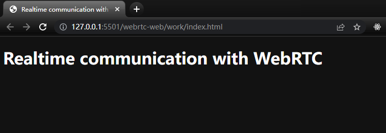

# 3. Start

## 获取项目基本代码

使用 git

```bash
git clone https://github.com/googlecodelabs/webrtc-web
```

## 搭建 Web Server，启动项目

使用 Live Sever 插件打开项目 work 目录下的 index.html 文件



出现这个页面就一切准备就绪，即将开启你的 WebRTC 之旅！
