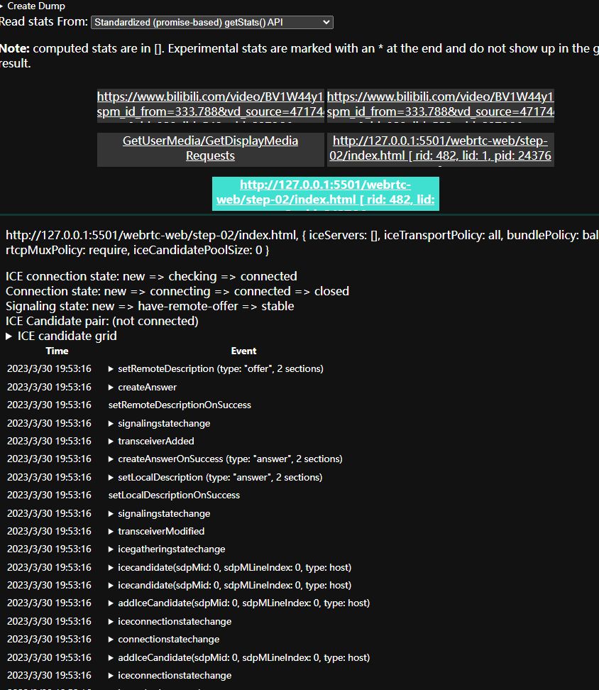

# 5. 探索 RTCPeerConnection 的使用

## 你将会学到

- Abstract away browser differences with the WebRTC shim, adapter.js. 使用 adapter.js 消除因为浏览器间的 WebRTC 语法差异
- Use the RTCPeerConnection API to stream video.
- 控制流媒体数据流

你可以查看项目 step-2 预览效果。

## 什么是 RTCPeerConnection

RTCPeerConnection API 可以用于调用视频、音频等媒体流，并且可以用于交换数据。

本案例主要是搭建一个可以在本页面通过两个 RTCPeerConnection 连接对象之间建立连接，进行视频流的传递。

虽然没什么实际用途，但简单有助于理解 RTCPeerConnection。

## 核心内容讲解

html、CSS 等内容无特殊的自主查看源码

### 实现原理

在对等体之间建立 WebRTC 连接涉及三个任务：

- 为双方创建 RTCPeerConnection 并且 localStream 通过`getUserMedia`获取媒体流
- 获取和共享网络信息（IP）：主要是得到能够连接的端点即 ICE 候选
- 获取并共享本地和远程的 descriptions(一种 SDP 格式的媒体元数据)

想象一下，Alice 和 Bob 两个人需要使用 RTCPeerConnection 进行视频聊天。

首先，Alice 和 Bob 需要交换双方的 网络信息（得知道对方的地址吧），这个寻找候选对象的过程使用了 ICE 架构去获取网络连接地址和端口。

1. Alice 创建了 RTCPeerConnection 并且监听了 `onicecandidate`, 找到可连接的 ICE 候选

   ```js
   let localPeerConnection;
   ```

   ```js
   localPeerConnection = new RTCPeerConnection(servers);
   localPeerConnection.addEventListener("icecandidate", handleConnection);
   localPeerConnection.addEventListener("iceconnectionstatechange", handleConnectionChange);
   ```

   > 在这个例子中 Servers 参数没有用到，设置为 null。这个参数你可以设置`STUN`服务器和`TURN`服务器。
   > 因为在现实的网络中，由于 NAT 和防火墙的限制，任意两个点对点的连接会失败，就需要`STUN` 去获取公网 IP 地址，`STUN`作为中继转发服务器实现点对点的连接。

2. Alice 调用 `getUserMedia()`获取视频流投喂给 video 并把流添加进己方 RTCPeerConnection

   ```js
   navigator.mediaDevices
     .getUserMedia(mediaStreamConstraints)
     .then(gotLocalMediaStream)
     .catch(handleLocalMediaStreamError);
   ```

   ```js
   function gotLocalMediaStream(mediaStream) {
     localVideo.srcObject = mediaStream;
     localStream = mediaStream;
     trace("Received local stream.");
     callButton.disabled = false; // Enable call button.
   }
   ```

   ```js
   localPeerConnection.addStream(localStream);
   trace("Added local stream to localPeerConnection.");
   ```

3. 当找到了 ICE candidates 候选时，触发 `onicecandidate`的回调

   ```js
   function handleConnection(event) {
     const peerConnection = event.target;
     const iceCandidate = event.candidate;

     if (iceCandidate) {
       const newIceCandidate = new RTCIceCandidate(iceCandidate);
       const otherPeer = getOtherPeer(peerConnection);

       otherPeer
         .addIceCandidate(newIceCandidate)
         .then(() => {
           handleConnectionSuccess(peerConnection);
         })
         .catch((error) => {
           handleConnectionFailure(peerConnection, error);
         });

       trace(`${getPeerName(peerConnection)} ICE candidate:\n` + `${event.candidate.candidate}.`);
     }
   }
   ```

4. Alice 将序列化后的候选数据发送给 Bob。在真实的应用中，这个过程发生消息的交换，也就 Signaling 过程。本案例由于是在同一个页面，RTCPeerConnection 可以直接通信，不需要额外的消息发送。

5. 当 Bob 收到了来自 Alice 的候选数据，Bob 会调用 `addIceCandidate()`添加候选数据到 remotePeerDescription。

   ```js
   function handleConnection(event) {
     const peerConnection = event.target;
     const iceCandidate = event.candidate;

     if (iceCandidate) {
       const newIceCandidate = new RTCIceCandidate(iceCandidate);
       const otherPeer = getOtherPeer(peerConnection);

       otherPeer
         .addIceCandidate(newIceCandidate)
         .then(() => {
           handleConnectionSuccess(peerConnection);
         })
         .catch((error) => {
           handleConnectionFailure(peerConnection, error);
         });

       trace(`${getPeerName(peerConnection)} ICE candidate:\n` + `${event.candidate.candidate}.`);
     }
   }
   ```

对等体的两端都需要交换本地和远程的媒体数据信息，比如分辨率和编解码器等。 Signaling 信令服务使用`SDP`的数据格式交换媒体配置信息（Offer 和 Answer）。

1. Alice 运行 `createOffer()` 方法，这个 Promise 方法会返回一个 RTCSessionDescription —— Alice 本地的 session 描述

   ```js
   trace("localPeerConnection createOffer start.");
   localPeerConnection.createOffer(offerOptions).then(createdOffer).catch(setSessionDescriptionError);
   ```

2. 上一步如果成功了，Alice 会用`setLocalDescription()`设置本地的 session 描述 以及通过信令服务器 Signaling 发送这个`description`描述给 Bob。

3. Bob 使用 `setRemoteDescription()`将 Alice 发送给他的描述设置为远程描述。
4. Bob 会将他从 Alice 那里拿到的 remoteDescription 传给 RTCPeerConnection 的`createAnswer()` 方法生成 Bob 本地的 local description,并将它发送给 Alice。
5. 当 Alice 收到了 Bob 的 session description，Alice 使用`setRemoteDescription()`将它设置成远程 description。

   ```js
   // Logs offer creation and sets peer connection session descriptions.
   function createdOffer(description) {
     trace(`Offer from localPeerConnection:\n${description.sdp}`);

     trace("localPeerConnection setLocalDescription start.");
     localPeerConnection
       .setLocalDescription(description)
       .then(() => {
         setLocalDescriptionSuccess(localPeerConnection);
       })
       .catch(setSessionDescriptionError);

     trace("remotePeerConnection setRemoteDescription start.");
     remotePeerConnection
       .setRemoteDescription(description)
       .then(() => {
         setRemoteDescriptionSuccess(remotePeerConnection);
       })
       .catch(setSessionDescriptionError);

     trace("remotePeerConnection createAnswer start.");
     remotePeerConnection.createAnswer().then(createdAnswer).catch(setSessionDescriptionError);
   }

   // Logs answer to offer creation and sets peer connection session descriptions.
   function createdAnswer(description) {
     trace(`Answer from remotePeerConnection:\n${description.sdp}.`);

     trace("remotePeerConnection setLocalDescription start.");
     remotePeerConnection
       .setLocalDescription(description)
       .then(() => {
         setLocalDescriptionSuccess(remotePeerConnection);
       })
       .catch(setSessionDescriptionError);

     trace("localPeerConnection setRemoteDescription start.");
     localPeerConnection
       .setRemoteDescription(description)
       .then(() => {
         setRemoteDescriptionSuccess(localPeerConnection);
       })
       .catch(setSessionDescriptionError);
   }
   ```

6. Alice 和 Bob 完成连接！

## 完整 JS 代码

```js
const eleQuerySelect = (el) => document.querySelector(el);

const localVideo = eleQuerySelect("#localVideo");
const remoteVideo = eleQuerySelect("#remoteVideo");

let localStream;
let remoteStream;

let localPeerConnection;
let remotePeerConnection;

const startBtn = eleQuerySelect("#startButton");
const callBtn = eleQuerySelect("#callButton");
const hangupButton = eleQuerySelect("#hangupButton");

/********
local set up
*********/

startBtn.onclick = start;

const mediaStreamConstraints = {
  video: true,
};
function start() {
  startButton.disabled = true;
  navigator.mediaDevices
    .getUserMedia(mediaStreamConstraints)
    .then(gotLocalMediaStream)
    .catch(handleLocalMediaStreamError);
  trace("Requesting local stream.");
}

function gotLocalMediaStream(stream) {
  localStream = stream;
  localVideo.srcObject = stream;
  console.log("1. 打开本地摄像头");
}

function handleLocalMediaStreamError(error) {
  trace(`navigator.getUserMedia error: ${error.toString()}.`);
}

function trace(text) {
  text = text.trim();
  const now = (window.performance.now() / 1000).toFixed(3);

  console.log(now, text);
}

/********
call
*********/
// 开始建立连接的时间
let startTime = null;

callBtn.onclick = callAction;

const offerOptions = {
  offerToReceiveVideo: 1,
};

function callAction() {
  callBtn.disabled = true;
  hangupButton.disabled = false;

  trace("2. 开始 Call");
  startTime = window.performance.now();

  // 显示本地使用的设备名
  const videoTracks = localStream.getVideoTracks();
  const audioTracks = localStream.getAudioTracks();
  if (videoTracks.length > 0) {
    trace(`使用 video device: ${videoTracks[0].label}.`);
  }
  if (audioTracks.length > 0) {
    trace(`Using audio device: ${audioTracks[0].label}.`);
  }

  const servers = null;

  localPeerConnection = new RTCPeerConnection(servers);
  trace("2-1. 创建了 localPeerConnection ");

  localPeerConnection.addEventListener("icecandidate", handleConnection);
  localPeerConnection.addEventListener("iceconnectionstatechange", handleConnectionChange);

  // 创建 remote peerConnection
  remotePeerConnection = new RTCPeerConnection(servers);
  trace("2-2. 创建了 remotePeerConnection");

  remotePeerConnection.addEventListener("icecandidate", handleConnection);
  remotePeerConnection.addEventListener("iceconnectionstatechange", handleConnectionChange);
  remotePeerConnection.addEventListener("addstream", gotRemoteMediaStream);

  // 到这，远程都还不能收到视频流，因为连接还没建立完成

  localPeerConnection.addStream(localStream);
  trace("2-3. 添加local stream 到 localPeerConnection.");
  // local peerConnection 创建 offer， offerOptions 设置了只允许传递video视频流
  localPeerConnection.createOffer(offerOptions).then(createdOffer).catch(setSessionDescriptionError);
  trace("2-4. localPeerConnection createOffer start.");
}

// 监听 ice candidate
// 与候选人建立连接
function handleConnection(event) {
  const peerConnection = event.target;
  const iceCandidate = event.candidate;
  trace(`${getPeerName(peerConnection)} 监听到了候选 ice candidate ${event.toString()}`);

  if (iceCandidate) {
    const newIceCandidate = new RTCIceCandidate(iceCandidate);
    const otherPeer = getOtherPeer(peerConnection);

    otherPeer
      .addIceCandidate(newIceCandidate)
      .then(() => {
        handleConnectionSuccess(peerConnection);
      })
      .catch((error) => {
        handleConnectionFailure(peerConnection, error);
      });

    trace(`${getPeerName(peerConnection)} ICE candidate:\n` + `${event.candidate.candidate}.`);
  }
}

function getOtherPeer(peerConnection) {
  return peerConnection === localPeerConnection ? remotePeerConnection : localPeerConnection;
}

function handleConnectionSuccess() {
  trace(`${getPeerName(peerConnection)} addIceCandidate success.`);
}

function getPeerName(peerConnection) {
  return peerConnection === localPeerConnection ? "localPeerConnection" : "remotePeerConnection";
}

function handleConnectionFailure(peerConnection, error) {
  trace(`${getPeerName(peerConnection)} failed to add ICE Candidate:\n` + `${error.toString()}.`);
}

// 监听 ice connection 状态改变
function handleConnectionChange(event) {
  const peerConnection = event.target;
  console.log("ICE state change event: ", event);
  trace(`${getPeerName(peerConnection)} ICE state: ` + `${peerConnection.iceConnectionState}.`);
}

function gotRemoteMediaStream(event) {
  const mediaStream = event.stream;
  remoteVideo.srcObject = mediaStream;
  remoteStream = mediaStream;
  trace("远程收到了视频流");
}

function createdOffer(description) {
  console.log(`2.5 createdOffer\n ${description}`);
  trace(`2.5 Offer from localPeerConnection: \n${description.sdp}`);

  trace("2.6 localPeerConnection 开始设置 localDescription.");
  localPeerConnection
    .setLocalDescription(description)
    .then(() => {
      setLocalDescriptionSuccess(localPeerConnection);
    })
    .catch(setSessionDescriptionError);

  trace("2.7 remotePeerConnection 开始设置 remoteDescription。");
  remotePeerConnection
    .setRemoteDescription(description)
    .then(() => {
      setRemoteDescriptionSuccess(remotePeerConnection);
    })
    .catch(setSessionDescriptionError);

  trace("2.8 remotePeerConnection 开始创建应答。");
  remotePeerConnection.createAnswer().then(createdAnswer).catch(setSessionDescriptionError);
}

function setLocalDescriptionSuccess(peerConnection) {
  setDescriptionSuccess(peerConnection, "setLocalDescription");
}

function setRemoteDescriptionSuccess(peerConnection) {
  setDescriptionSuccess(peerConnection, "setRemoteDescription");
}

function setDescriptionSuccess(peerConnection, functionName) {
  const peerName = getPeerName(peerConnection);
  trace(`${peerName} ${functionName} complete `);
}

function setSessionDescriptionError(error) {
  trace(`Failed to create session description: ${error.toString()}.`);
}

function createdAnswer(description) {
  trace(`来自远程端的 remoteDescription：\n ${description.sdp}`);

  trace("remotePeerConnection 开始设置 localDescription。");
  remotePeerConnection
    .setLocalDescription(description)
    .then(() => {
      setLocalDescriptionSuccess(remotePeerConnection);
    })
    .catch(setSessionDescriptionError);

  trace("localPeerConnection 开始设置 RemoteDescription.");
  localPeerConnection
    .setRemoteDescription(description)
    .then(() => {
      setRemoteDescriptionSuccess(localPeerConnection);
    })
    .catch(setSessionDescriptionError);
}

// 上述代码完成localPeerConnection 和 remotePeerConnection的连接

/********
hangup
*********/
hangupButton.disabled = true;

hangupButton.onclick = hangupAction;

function hangupAction() {
  //  localPeerConnection 断开连接，远程remoteVideo就不能再接收视频流了，但没有黑屏，保留断开前的最后一帧
  localPeerConnection.close();
  //   远程断开连接，远程 remoteVideo 不再播放视频流黑屏
  remotePeerConnection.close();

  //   释放localPeerConnection 和 remotePeerConnection对象 GC
  localPeerConnection = null;
  remotePeerConnection = null;

  hangupButton.disabled = true;
  callButton.disabled = false;

  trace("Ending Call.");

  // 最后应该还有关闭本地摄像头
  closeMediaDevices();
}

function closeMediaDevices() {
  const videoTracks = localStream.getVideoTracks();
  const audioTracks = localStream.getAudioTracks();

  if (videoTracks.length > 0) {
    videoTracks.forEach((track) => track.stop());
  }

  if (audioTracks.length > 0) {
    audioTracks.forEach((track) => track.stop());
  }

  trace("关闭了设备");

  startBtn.disabled = false;
}
```

## Bouns points 加分点

1. 尝试打开 `chorme://webrtc-internals`。它将提供 WebRTC state and debugging data. (chrome 工具完整路径： chrome://about)
   
2. 美化一下案例页面
   - 让两个 video 并排摆放
   - 按钮设置相同的宽度，用更大的字体
   - 确保在移动端的布局
3. 在 Chrome Dev Tools 控制台查看 `localStream` , `localPeerConnection` 和 `remotePeerConnection`等对象，加深印象
4. 在控制台查看`localPeerConnection.localDescription`, 看看什么是`SDP`消息格式。

## 本课你已掌握

- [x] 如果要消除浏览器间 WebRTC 语法的差异，要使用 adapter.js 适配器；
- [x] 熟悉 WebRTCPeerConnection API 实现 视频流 本地和远程的播放；
- [x] 捕获视频流并且控制它的传送
- [x] 实现点对点 共享 Media 信息 和 network 网络连接信息

## Tip

1. `window.performance.now()` 与 `Date.now（）` 的区别：

   - 前者返回的事件戳没有被限制在一毫秒的精确度内，相反，它们以浮点数的形式表示时间，精确度最高可达微妙级
   - 另一个不同点，`window.performance.now()`是以一个恒定的速率慢慢增加的，它不会受到系统时间的影响（系统时间可能会被手动调整或被 NTP 等软件篡改）。
   - 额外：`performance.timing.navigationStart + performance.now()` 约等于 `Date.now()`。
   - `performance.now()` 的精度可能因浏览器的不同而不同

2. 拓展，想知道 WebRTC 的最佳应用实现是什么样的吗？那就看看 AppRTC 吧，一款完美实现了 WebRTC 的应用，延迟时间小于 500ms。AppRTC 的 Git 地址：[https://github.com/webrtc/apprtc]
   这个项目的在线应用服务器已经停了，需要自己搭建。

## 最佳实践

官方推荐我们使用 Promise 语法和 adapter.js 来书写我们的 WebRTC 代码。在源码中也能看到官方给的例子都是基于这两点的。
